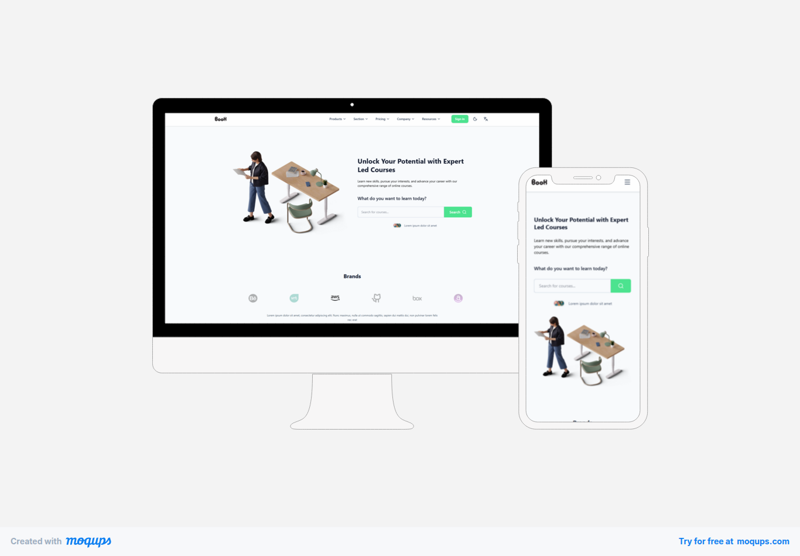

# Book Online Learning Platform (MERN)

<p align="center">
  
</p>

<p align="center">
  <b>Courses • Enrollment • RBAC • Secure Auth (HttpOnly Cookies)</b>
</p>

---

## 🌐 Live Demo
- Frontend: https://YOUR-FRONTEND-DOMAIN.com  
- Backend API: https://YOUR-BACKEND-DOMAIN.com/api/v1  

> **Note:** Add your deployed frontend domain to backend environment variable `CLIENT_ORIGINS` (comma-separated).

---

## ✨ Features

### 👨‍🎓 Student
- Register / Login / Logout
- Browse published courses
- View course details
- Enroll in courses
- View **My Enrollments**

### 👨‍🏫 Instructor / Admin
- Create / Update / Delete courses
- View their own courses (instructor)
- Admin can view/manage all courses

### 🔒 Security
- JWT authentication via **HttpOnly cookies**
- CORS allowlist (credentials enabled)
- Helmet security headers
- Rate limiting
- Zod validation
- Origin/Referer guard

---

## 🛠 Tech Stack

### Frontend
- React + TypeScript (Vite)
- Tailwind CSS
- React Router
- Redux Toolkit + RTK Query
- Formik + Yup
- lucide-react

### Backend
- Node.js + Express (TypeScript)
- MongoDB Atlas + Mongoose
- JWT (Access/Refresh) via HttpOnly Cookies
- Zod validation
- Helmet, CORS allowlist, rate limiting
- API Versioning: `/api/v1`

---

## 📁 Project Structure
```text
root/
├── client/          # React (Vite) frontend
├── server/          # Express (TypeScript) backend
├── docs/            # Documentation & assets
└── README.md        # This file
